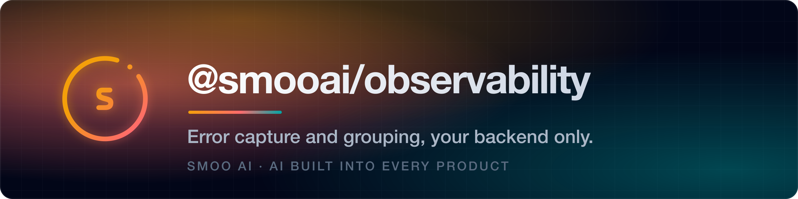
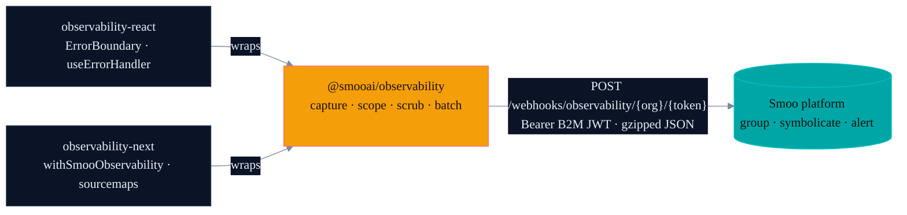

<a name="readme-top"></a>

<p align="center">
  <a href="https://smoo.ai"></a>
</p>

<p align="center">
  <a href="https://www.npmjs.com/package/@smooai/observability"></a>
  <a href="https://smoo.ai"></a>
  
</p>

<p align="center">
  
  
  
</p>

<p align="center">
  <a href="#-features"><b>Features</b></a> &nbsp;·&nbsp; <a href="#-install"><b>Install</b></a> &nbsp;·&nbsp; <a href="#-usage"><b>Usage</b></a> &nbsp;·&nbsp; <a href="#-architecture"><b>Architecture</b></a> &nbsp;·&nbsp; <a href="#-part-of-smoo-ai"><b>Platform</b></a>
</p>

---

> The error-tracking platform we wished was already in our stack. You ship a deploy; somewhere out there a webpack chunk is 404'ing for one user and your sign-in page is silently broken. Your error boundary `console.error`s into the void, and your only signal is the support ticket that arrives forty minutes later. `@smooai/observability` fills that gap: automatic capture and grouping across every runtime, your events going to **your** Smoo backend only.

## ✨ Features

**Browser**

- 🛑 **Uncaught exceptions** — `window.onerror`, `unhandledrejection`, `console.error` taps
- 🍞 **Breadcrumbs** — `fetch` / `XHR` calls, click events, navigation events, custom traces
- 🧭 **Release tagging** — every event ships with the git sha so symbolication is one click away
- 🗺️ **Source maps** — uploaded to S3 at build time, applied lazily on view
- 🚪 **Beacon flush** — events queued at `pagehide` ship via `navigator.sendBeacon`
- 💾 **Offline queue** — events captured while offline persist in `IndexedDB` and retry on focus
- 🔐 **PII scrub** — `password`, `token`, `Bearer ...`, and friends are redacted before transport

**Node**

- 🛑 **`uncaughtException` + `unhandledRejection`** with full stack
- 🪢 **Hono middleware** — captures errors propagating to the global `onError` handler
- 🧠 **AsyncLocalStorage scope** — per-request user, tags, breadcrumbs without leaking across requests
- 📦 **Batched transport** — `undici` with retry / backoff
- 🔐 **Same PII scrub policy** as the browser

**React / Next.js**

- 🧱 **`<ErrorBoundary>`** — drop-in component, captures and renders your fallback
- ⚓ **`useErrorHandler()`** — for async event-handler errors React boundaries can't see
- 🏗️ **`withSmooObservability(nextConfig)`** — enables production browser source maps and uploads them in CI
- 🛡️ **`<RootErrorBoundary>`** — drop into `app/global-error.tsx` / `app/error.tsx`

### What does NOT get captured

- `console.log` / `console.info` / `console.warn` — only `console.error` is tapped, and that's opt-out
- HTTP request **bodies** — only method, path, status, and duration appear in breadcrumbs
- Anything matching the PII scrub regex unless you explicitly allowlist it

## 📦 Install

```sh
pnpm add @smooai/observability                      # core (browser + Node)
pnpm add @smooai/observability-react                # React bindings
pnpm add @smooai/observability-next                 # Next.js wrapper
```

or with npm / yarn / bun — same names.

| Package                                         | npm                                                                                                                                       | Purpose                                     |
| ----------------------------------------------- | ----------------------------------------------------------------------------------------------------------------------------------------- | ------------------------------------------- |
| [`@smooai/observability`](packages/core)        | [](https://www.npmjs.com/package/@smooai/observability)             | Core client — browser + Node universal      |
| [`@smooai/observability-react`](packages/react) | [](https://www.npmjs.com/package/@smooai/observability-react) | React `<ErrorBoundary>` + `useErrorHandler` |
| [`@smooai/observability-next`](packages/next)   | [](https://www.npmjs.com/package/@smooai/observability-next)   | Next.js wrapper + sourcemap upload          |

## 🚀 Usage

### Next.js

```ts
// next.config.ts
import { withSmooObservability } from '@smooai/observability-next/build';

export default withSmooObservability(
    {
        /* your config */
    },
    {
        org: 'your-org',
        release: process.env.GITHUB_SHA ?? 'dev',
        uploadSourcemaps: process.env.CI === 'true',
    },
);
```

```ts
// instrumentation.ts
export async function register() {
    const { Client } = await import('@smooai/observability');
    Client.init({
        dsn: process.env.OBSERVABILITY_INGEST_URL!,
        environment: process.env.STAGE,
        release: process.env.GITHUB_SHA ?? 'dev',
    });
}
```

```tsx
// app/global-error.tsx
'use client';
import { RootErrorBoundary } from '@smooai/observability-next';

export default function GlobalError({ error, reset }: { error: Error & { digest?: string }; reset: () => void }) {
    return (
        <html>
            <body>
                <RootErrorBoundary error={error} resetError={reset} fallback={<YourBrandedError onRetry={reset} />} />
            </body>
        </html>
    );
}
```

### Browser SPA

```ts
import { Client } from '@smooai/observability';

Client.init({
    dsn: process.env.SMOO_OBSERVABILITY_DSN!,
    environment: 'production',
    release: import.meta.env.VITE_GIT_SHA,
});

Client.setUser({ id: 'user_abc', orgId: 'org_xyz' });
```

### Node / Hono

```ts
import { Client, observabilityMiddleware } from '@smooai/observability/node';

Client.init({
    dsn: process.env.OBSERVABILITY_INGEST_URL!,
    environment: process.env.STAGE!,
    release: process.env.LAMBDA_FUNCTION_VERSION ?? 'dev',
});

app.use('*', observabilityMiddleware());
```

### Multi-language support

The same ingest contract (`POST /webhooks/observability/{org_id}/{token}` with `type: 'error'`) accepts events from any language. Follow-up SDKs:

- 🐍 **Python** — `smooai-observability` on PyPI (tracked in SMOODEV-1067 follow-ups)
- 🦀 **Rust** — `smooai-observability` crate (tracked in SMOODEV-1067 follow-ups)
- 🐹 **Go** — `github.com/smooai/observability-go` (tracked in SMOODEV-1067 follow-ups)
- 💠 **.NET** — `SmooAI.Observability` on NuGet (tracked in SMOODEV-1067 follow-ups)

## 📖 Architecture

The SDK is intentionally thin. It captures, batches, redacts PII, and POSTs to a Smoo ingest endpoint. All of the heavy lifting — fingerprint grouping, source-map symbolication, dashboards, alerts, retention — lives in the Smoo platform.



Full backend architecture: [SmooAI/smooai → docs/Architecture/Observability-Architecture.md](https://github.com/SmooAI/smooai/blob/main/docs/Architecture/Observability-Architecture.md).

## 📖 Built with

- **TypeScript** — strict mode, ESM-only, dual browser/Node entries via package `exports` map
- **tsup** — bundling, dual ESM/types output, sourcemaps
- **turborepo** — fast pipeline across the three packages
- **vitest** — unit tests
- **changesets** — versioning + npm publish via GitHub Actions

## 📖 Privacy & telemetry

This SDK is opinionated about privacy:

- We never capture form bodies, request bodies, or response bodies by default
- We never capture cookies
- We never send anything to a third-party service — your events go to **your** Smoo backend only
- PII scrubbing is enabled by default and can be tuned per-tenant

## 📖 Status

`0.1.0` — types and client skeleton are stable. The capture handlers, stack parsers, transport, and source-map upload land incrementally in upcoming `0.x` releases. The backend ingest, fingerprint grouping, dashboard, and customer-org rollout live in the [SmooAI/smooai monorepo](https://github.com/SmooAI/smooai) and are tracked under [SMOODEV-1067](https://smooai.atlassian.net/browse/SMOODEV-1067).

## 🧩 Part of Smoo AI {#part-of-smoo-ai}

`@smooai/observability` is built and open-sourced by **[Smoo AI](https://smoo.ai)** — the AI-powered business platform with AI built into every product: CRM, customer support, campaigns, field service, observability, and developer tools.

- 🚀 **Observability on the platform** — [smoo.ai/platform/observability](https://smoo.ai/platform/observability)
- 🧰 **More open source from Smoo AI** — [smoo.ai/open-source](https://smoo.ai/open-source)
- 🧩 **Sibling packages** — [@smooai/logger](https://github.com/SmooAI/logger), [@smooai/config](https://github.com/SmooAI/config), [@smooai/fetch](https://github.com/SmooAI/fetch), [smooth](https://github.com/SmooAI/smooth) (the `th` CLI)

## 🤝 Contributing

Issues and PRs welcome. Maintained by Brent Rager — [email](mailto:brent@smoo.ai) · [LinkedIn](https://www.linkedin.com/in/brentrager/) · [BlueSky](https://bsky.app/profile/brentragertech.bsky.social) · [TikTok](https://www.tiktok.com/@brentragertech) · [Instagram](https://www.instagram.com/brentragertech/).

## 📄 License

MIT © Smoo AI, Inc. See [LICENSE](LICENSE).

<p align="right">(<a href="#readme-top">back to top</a>)</p>

---

<p align="center">
  Built by <a href="https://smoo.ai"><strong>Smoo AI</strong></a> — AI built into every product.
</p>
