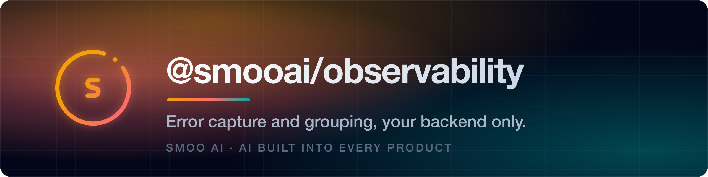
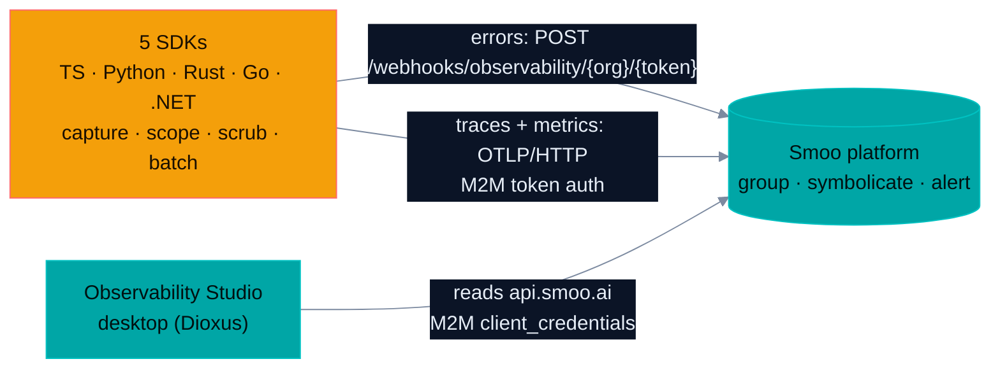

<a name="readme-top"></a>

<p align="center">
  <a href="https://smoo.ai"></a>
</p>

<p align="center">
  <a href="https://www.npmjs.com/package/@smooai/observability"></a>
  <a href="https://smoo.ai"></a>
  
</p>

<p align="center">
  
  
  
  
</p>

<p align="center">
  <a href="#what-is-this"><b>What it is</b></a> &nbsp;·&nbsp; <a href="#-feature-tour"><b>Feature tour</b></a> &nbsp;·&nbsp; <a href="#-install"><b>Install</b></a> &nbsp;·&nbsp; <a href="#-usage"><b>Usage</b></a> &nbsp;·&nbsp; <a href="#-five-sdks-one-contract"><b>SDK status</b></a> &nbsp;·&nbsp; <a href="#-architecture"><b>Architecture</b></a> &nbsp;·&nbsp; <a href="#-observability-studio-desktop"><b>Studio</b></a> &nbsp;·&nbsp; <a href="#-part-of-smoo-ai"><b>Platform</b></a>
</p>

---

> The error-tracking platform we wished was already in our stack. You ship a deploy; somewhere out there a webpack chunk is 404'ing for one user and your sign-in page is silently broken. Your error boundary `console.error`s into the void, and your only signal is the support ticket that arrives forty minutes later. `@smooai/observability` fills that gap: automatic capture, breadcrumbs, PII scrubbing, OpenTelemetry traces + metrics, and GenAI telemetry — with SDKs in **five languages** speaking **one ingest contract**, your events going to **your** Smoo backend only. Plus a native **desktop studio** to read it all.

## What is this?

A monorepo of observability SDKs — **TypeScript** (the reference, on npm), **Python**, **Rust**, **Go**, and **.NET** (complete and CI-tested, in-repo) — plus a native **Dioxus desktop client**. Every SDK captures errors with breadcrumbs and scoped context, scrubs PII before anything leaves the process, exports OpenTelemetry traces and metrics over OTLP with M2M auth, and POSTs error events to the same ingest endpoint (`POST /webhooks/observability/{org_id}/{token}`). The heavy lifting — fingerprint grouping, source-map symbolication, dashboards, alerts, retention — lives in the [Smoo platform](https://github.com/SmooAI/smooai).

## ✨ Feature tour

|     | Capability                                                  | What you get                                                                 |
| --- | ----------------------------------------------------------- | ---------------------------------------------------------------------------- |
| 🛑  | [**Error capture**](#error-capture--every-language)         | Uncaught exceptions + crash handlers in all five languages                   |
| 🍞  | [**Breadcrumbs + scope**](#error-capture--every-language)   | Request-scoped user, tags, and a trail of what led to the error              |
| 🔐  | [**PII scrub**](#-privacy--telemetry)                       | Credentials dropped; emails/phones HMAC-hashed per-org — all five SDKs       |
| 🔭  | [**OTel traces + metrics**](#error-capture--every-language) | OTLP/HTTP export with M2M token auth — all five SDKs                         |
| 🤖  | [**GenAI telemetry**](#-genai-telemetry-gen_ai)             | `gen_ai.*` semconv helpers everywhere; `wrapOpenAI` + LangChain integrations |
| 🧱  | [**React / Next.js**](#nextjs)                              | `<ErrorBoundary>`, `useErrorHandler`, source-map upload — TypeScript only    |
| 🖥️  | [**Desktop studio**](#-observability-studio-desktop)        | Native logs/errors/metrics client, multi-org, keychain-stored creds          |

### Error capture — every language

Every SDK ships the same core: `captureException` (+ each runtime's global crash hooks), breadcrumbs, a request/task-scoped context that doesn't leak across requests, a batched retrying webhook transport, PII scrubbing, and OTLP trace + metric export. What differs per language is the framework glue:

|                                                 | TypeScript   | Python                         | Rust                | Go                     | .NET                |
| ----------------------------------------------- | ------------ | ------------------------------ | ------------------- | ---------------------- | ------------------- |
| Error capture + crash handlers                  | ✅           | ✅                             | ✅                  | ✅                     | ✅                  |
| Breadcrumbs + scoped context                    | ✅           | ✅                             | ✅                  | ✅                     | ✅                  |
| Batched webhook transport                       | ✅           | ✅                             | ✅                  | ✅                     | ✅                  |
| PII scrub + per-org HMAC hashing                | ✅           | ✅                             | ✅                  | ✅                     | ✅                  |
| OTel traces + metrics (OTLP, M2M auth)          | ✅           | ✅                             | ✅                  | ✅                     | ✅                  |
| GenAI `gen_ai.*` helpers                        | ✅           | ✅                             | ✅                  | ✅                     | ✅                  |
| HTTP middleware                                 | Hono         | FastAPI / Starlette            | tower · reqwest     | net/http · Fiber · Gin | ASP.NET Core        |
| LLM client instrumentation                      | `wrapOpenAI` | LangChain / LangGraph callback | —                   | —                      | —                   |
| Log/session sampling (FNV-1a parity corpus)     | ✅           | ✅                             | ✅                  | ✅                     | ✅                  |
| Source-map upload                               | ✅           | n/a                            | n/a                 | n/a                    | n/a                 |
| React / Next.js bindings                        | ✅           | n/a                            | n/a                 | n/a                    | n/a                 |
| Browser: beacon flush + IndexedDB offline queue | ✅           | n/a                            | n/a                 | n/a                    | n/a                 |
| **Published**                                   | npm          | in-repo, unreleased            | in-repo, unreleased | in-repo, unreleased    | in-repo, unreleased |

Browser extras (TypeScript only): `window.onerror` / `unhandledrejection` / `console.error` taps, `fetch`/XHR/click/navigation breadcrumbs, release tagging with the git sha, `navigator.sendBeacon` flush at `pagehide`, and an IndexedDB offline queue that retries on focus.

### What does NOT get captured

- `console.log` / `console.info` / `console.warn` — only `console.error` is tapped, and that's opt-out
- HTTP request **bodies** — only method, path, status, and duration appear in breadcrumbs
- Credentials matching the PII scrub regex — dropped outright, never hashed
- Raw emails / phones / street addresses — replaced by a keyed per-org hash, never stored in the clear

## 📦 Install

**TypeScript** is the published SDK — React and Next.js bindings are subpath exports of the same package, not separate installs:

```sh
pnpm add @smooai/observability     # core — plus /react, /next, /node, /otel, /metrics subpaths
```

**Python, Rust, Go, and .NET are complete and CI-tested, but not yet on their registries** (PyPI / crates.io / NuGet publishing is set up in [`publish.yml`](.github/workflows/publish.yml) and lands with the first language tag). Until then, use them from source:

| SDK                         | Source                                           | Registry status                                                                                                                                  |
| --------------------------- | ------------------------------------------------ | ------------------------------------------------------------------------------------------------------------------------------------------------ |
| [TypeScript](packages/core) | `packages/core`                                  | [](https://www.npmjs.com/package/@smooai/observability) |
| [Python](python)            | `python/` (`smooai_observability`)               | unreleased — not yet on PyPI                                                                                                                     |
| [Rust](rust)                | `rust/observability` (`smooai-observability`)    | unreleased — not yet on crates.io                                                                                                                |
| [Go](go)                    | `go get github.com/SmooAI/observability/go@main` | no SemVer tag yet — `@main` resolves via the module proxy                                                                                        |
| [.NET](dotnet)              | `dotnet/` (`SmooAI.Observability`)               | unreleased — not yet on NuGet                                                                                                                    |

## 🚀 Usage

### Next.js

```ts
// next.config.ts
import { withSmooObservability } from '@smooai/observability/next/build';

export default withSmooObservability(
    {
        /* your config */
    },
    {
        org: 'your-org',
        release: process.env.GITHUB_SHA ?? 'dev',
        uploadSourcemaps: process.env.CI === 'true',
    },
);
```

```ts
// instrumentation.ts
export async function register() {
    const { Client } = await import('@smooai/observability');
    Client.init({
        dsn: process.env.OBSERVABILITY_INGEST_URL!,
        environment: process.env.STAGE,
        release: process.env.GITHUB_SHA ?? 'dev',
    });
}
```

```tsx
// app/global-error.tsx
'use client';
import { RootErrorBoundary } from '@smooai/observability/next';

export default function GlobalError({ error, reset }: { error: Error & { digest?: string }; reset: () => void }) {
    return (
        <html>
            <body>
                <RootErrorBoundary error={error} resetError={reset} fallback={<YourBrandedError onRetry={reset} />} />
            </body>
        </html>
    );
}
```

### Browser SPA

```ts
import { Client } from '@smooai/observability';

Client.init({
    dsn: process.env.SMOO_OBSERVABILITY_DSN!,
    environment: 'production',
    release: import.meta.env.VITE_GIT_SHA,
});

Client.setUser({ id: 'user_abc', orgId: 'org_xyz' });
```

React bindings live at the `/react` subpath — `import { ErrorBoundary, useErrorHandler } from '@smooai/observability/react'`.

### Node / Hono

```ts
import { Client, observabilityMiddleware } from '@smooai/observability/node';

Client.init({
    dsn: process.env.OBSERVABILITY_INGEST_URL!,
    environment: process.env.STAGE!,
    release: process.env.LAMBDA_FUNCTION_VERSION ?? 'dev',
});

app.use('*', observabilityMiddleware());
```

### Python / Rust / Go / .NET

Same shape, native idioms — each sub-README has the full walkthrough: [`python/`](python/README.md) (FastAPI middleware, LangChain callback, crash hooks), [`rust/`](rust/README.md) (tower + reqwest middleware), [`go/`](go/README.md) (net/http, Fiber, Gin), [`dotnet/`](dotnet/README.md) (ASP.NET Core middleware). A taste of Python:

```python
from smooai_observability import bootstrap_observability, capture_exception

bootstrap_observability()  # reads SMOOAI_OBSERVABILITY_* env vars (never raises)

try:
    risky()
except Exception as err:
    capture_exception(err, tags={"area": "ingest"})
```

### 🤖 GenAI telemetry (`gen_ai.*`)

LLM and agent spans carry the [OTel GenAI semantic conventions](https://opentelemetry.io/docs/specs/semconv/gen-ai/), so any semconv-aware backend reads them — Smoo's LLM dashboard routes on `gen_ai.system` alone.

```ts
import OpenAI from 'openai';
import { wrapOpenAI } from '@smooai/observability';

// Instruments chat.completions.create — the original client is untouched.
const openai = wrapOpenAI(new OpenAI(), {
    conversationId: conversation.id,
    // Providers don't return a price. Supply one and the cost column fills in.
    costUsd: ({ inputTokens = 0, outputTokens = 0 }) => inputTokens * 2.5e-6 + outputTokens * 1e-5,
});
```

The same wrapper covers Groq, Together, Fireworks, DeepSeek, Azure OpenAI, and any OpenAI-compatible gateway — pass `{ system: 'groq' }` so spans attribute to the real provider. Prompt and completion **content is off by default**; `{ recordContent: true }` records it as `gen_ai.*.message` span events, PII-scrubbed on the way out.

For hand-rolled calls, set the attributes directly:

```ts
import { setGenAIAttributes, recordGenAIMessage } from '@smooai/observability';

setGenAIAttributes(span, { system: 'anthropic', operationName: 'chat', requestModel: 'claude-opus-4-7', usageInputTokens: 812, usageOutputTokens: 96 });
```

> `gen_ai.operation.name` is a straight passthrough on ingest with **no fallback** — leave it unset and the operation column lands `NULL`. Always set it.

**Parity across the five SDKs:**

| SDK            | Attribute helper              | Message events                | Content PII-scrubbed | Framework integration                               |
| -------------- | ----------------------------- | ----------------------------- | -------------------- | --------------------------------------------------- |
| **TypeScript** | `setGenAIAttributes`          | `recordGenAIMessage`          | ✅                   | ✅ `wrapOpenAI` — OpenAI Node SDK + compatible APIs |
| **Rust**       | `set_gen_ai_attributes`       | `record_gen_ai_message`       | ❌                   | —                                                   |
| **Python**     | `set_gen_ai_attributes`       | `record_gen_ai_message`       | ❌                   | ✅ `SmooAICallbackHandler` — LangChain / LangGraph  |
| **Go**         | `SetGenAIAttributes`          | `RecordGenAIMessage`          | ❌                   | —                                                   |
| **.NET**       | `GenAIActivity.SetAttributes` | `GenAIActivity.RecordMessage` | ❌                   | —                                                   |

Known divergences: TypeScript, Python, Go and .NET emit `gen_ai.tool.names` as a **string array**; Rust emits a comma-joined string. Only TypeScript scrubs recorded message content today.

### 📐 Cross-language parity, honestly

[`parity/sampling-corpus.json`](parity/README.md) pins **170 vectors** for the FNV-1a session sampler, level normalization, W3C traceparent parse/format, and settings resolution. All five SDKs implement it and all five CI lanes load **that same file** — a language that cannot reproduce a vector fails its build:

| SDK            | Loader                                                                                                   |
| -------------- | -------------------------------------------------------------------------------------------------------- |
| **TypeScript** | [`packages/core/src/__tests__/parity-corpus.test.ts`](packages/core/src/__tests__/parity-corpus.test.ts) |
| **Rust**       | [`rust/observability/tests/parity_corpus.rs`](rust/observability/tests/parity_corpus.rs)                 |
| **Python**     | [`python/tests/test_parity_corpus.py`](python/tests/test_parity_corpus.py)                               |
| **Go**         | [`go/parity_corpus_test.go`](go/parity_corpus_test.go)                                                   |
| **.NET**       | [`dotnet/tests/.../ParityCorpusTests.cs`](dotnet/tests/SmooAI.Observability.Tests/ParityCorpusTests.cs)  |

`parity/**` is a path-filter trigger for every language lane, so touching the corpus re-runs all five.

The PII token — the `[email:02ea437f]` handle that replaces a personal identifier — has its own shared corpus, [`parity/pii-corpus.json`](parity/PII-README.md), loaded by the same five lanes. It pins the HMAC message framing, the per-org salt, the per-kind normalization, and the no-key redaction fallback.

## 📖 Architecture

The SDK is intentionally thin. It captures, batches, redacts credentials, hashes personal identifiers, and POSTs to a Smoo ingest endpoint. All of the heavy lifting — fingerprint grouping, source-map symbolication, dashboards, alerts, retention — lives in the Smoo platform.


```mermaid
%%{init: {'theme':'base','themeVariables':{
  'background':'#020618','primaryColor':'#0b1426','primaryTextColor':'#e6edf6','primaryBorderColor':'#2b3a52',
  'lineColor':'#7c8aa0','secondaryColor':'#0b1426','tertiaryColor':'#0b1426','fontFamily':'ui-sans-serif, system-ui, sans-serif',
  'clusterBkg':'#0b1426','clusterBorder':'#22304a'}}}%%
flowchart LR
  SDKS["5 SDKs<br/>TS · Python · Rust · Go · .NET<br/>capture · scope · scrub · batch"]
  SDKS -->|"errors: POST /webhooks/observability/{org}/{token}"| INGEST[("Smoo platform<br/>group · symbolicate · alert")]
  SDKS -->|"traces + metrics: OTLP/HTTP<br/>M2M token auth"| INGEST
  STUDIO["Observability Studio<br/>desktop (Dioxus)"] -->|"reads api.smoo.ai<br/>M2M client_credentials"| INGEST

  classDef warm fill:#f49f0a,stroke:#ff6b6c,color:#1a0f00;
  classDef teal fill:#00a6a6,stroke:#00c2c2,color:#011;
  class SDKS warm
  class INGEST,STUDIO teal
```

Full backend architecture: [SmooAI/smooai → docs/Architecture/Observability-Architecture.md](https://github.com/SmooAI/smooai/blob/main/docs/Architecture/Observability-Architecture.md).

## 🖥️ Observability Studio (desktop)

[`desktop/`](desktop/README.md) is a native desktop client for the whole stack — logs, errors, and metrics from `api.smoo.ai`, multi-org with credentials in your OS keychain, `Cmd+K` org/view switching. Built with Dioxus on the shared [`@smooai/ui`](https://github.com/SmooAI/ui) design system. Unsigned bundles for macOS / Linux / Windows ship from the [`studio-v*` GitHub Releases](https://github.com/SmooAI/observability/releases); or `cargo run --release -p observability-studio-app` from `desktop/`.

## 🗂️ Five SDKs, one contract

| Path                             | What it is                                                                                                               | Tests / CI                                                                                                               |
| -------------------------------- | ------------------------------------------------------------------------------------------------------------------------ | ------------------------------------------------------------------------------------------------------------------------ |
| [`packages/core`](packages/core) | **TypeScript** reference SDK — browser + Node entries, `/react` · `/next` · `/otel` · `/metrics` · `/bootstrap` subpaths | vitest, published via changesets                                                                                         |
| [`python/`](python)              | **Python** SDK — capture, crash hooks, OTel, GenAI, FastAPI + LangChain integrations                                     | pytest lane in [`pr-checks.yml`](.github/workflows/pr-checks.yml)                                                        |
| [`rust/`](rust)                  | **Rust** SDK (`smooai-observability`) — capture, OTel, GenAI, tower + reqwest middleware                                 | cargo test + clippy lane                                                                                                 |
| [`go/`](go)                      | **Go** SDK — capture, OTel, GenAI, net/http + [Fiber](go/fiber) + [Gin](go/gin) middleware                               | go test lane                                                                                                             |
| [`dotnet/`](dotnet)              | **.NET** SDK (`SmooAI.Observability`) — capture, OTel, GenAI, ASP.NET Core middleware                                    | dotnet test lane                                                                                                         |
| [`desktop/`](desktop)            | **Observability Studio** — Dioxus desktop client                                                                         | fmt + clippy + test lane; [`build-desktop.yml`](.github/workflows/build-desktop.yml) bundles 3 OSes on a `studio-v*` tag |
| [`parity/`](parity)              | Shared corpora — [sampling/traceparent/settings](parity/README.md) and [PII tokens](parity/PII-README.md)                | both loaded by all five language lanes                                                                                   |

Every language runs typecheck/lint/format/test in its own [`pr-checks.yml`](.github/workflows/pr-checks.yml) lane on every PR that touches it.

## 📖 Built with

- **TypeScript** — strict mode, ESM-only, dual browser/Node entries via package `exports` map; tsup, turborepo, vitest, changesets
- **Python 3** — `uv`-managed, pytest
- **Rust** — cargo workspace (`rust/` SDK, `desktop/` Dioxus app), clippy `-D warnings`
- **Go** — stdlib-first module with Fiber/Gin subpackages
- **.NET** — single `SmooAI.Observability` project + xUnit tests

## 📖 Privacy & telemetry

This SDK is opinionated about privacy:

- We never capture form bodies, request bodies, or response bodies by default
- We never capture cookies
- We never send anything to a third-party service — your events go to **your** Smoo backend only
- PII scrubbing is enabled by default and can be tuned per-tenant. Personal identifiers are hashed with HMAC-SHA256 under a key you supply (`SMOOAI_OBSERVABILITY_PII_HASH_KEY`), salted by org id — identical across the TypeScript, Rust, Go, Python and .NET SDKs. **With no key configured they are fully redacted, never hashed under a guessable one.**

## 📖 Status

The **TypeScript SDK** is live on npm and in production across the Smoo platform. The **Python, Rust, Go, and .NET SDKs** are feature-complete and CI-tested in-repo but **not yet published** to PyPI / crates.io / NuGet — the publish workflow ([`publish.yml`](.github/workflows/publish.yml)) is tag-triggered and no language tag has shipped yet. The **desktop studio** ships unsigned bundles from `studio-v*` releases. Backend ingest, fingerprint grouping, and dashboards live in the [SmooAI/smooai monorepo](https://github.com/SmooAI/smooai) under [SMOODEV-1067](https://smooai.atlassian.net/browse/SMOODEV-1067).

## 🧩 Part of Smoo AI {#part-of-smoo-ai}

`@smooai/observability` is built and open-sourced by **[Smoo AI](https://smoo.ai)** — the AI-powered business platform with AI built into every product: CRM, customer support, campaigns, field service, observability, and developer tools.

- 🚀 **Observability on the platform** — [smoo.ai/platform/observability](https://smoo.ai/platform/observability)
- 🧰 **More open source from Smoo AI** — [smoo.ai/open-source](https://smoo.ai/open-source)
- 🧩 **Sibling packages** — [@smooai/logger](https://github.com/SmooAI/logger), [@smooai/config](https://github.com/SmooAI/config), [@smooai/fetch](https://github.com/SmooAI/fetch), [smooth](https://github.com/SmooAI/smooth) (the `th` CLI)

## 🤝 Contributing

Issues and PRs welcome. Maintained by Brent Rager — [email](mailto:brent@smoo.ai) · [LinkedIn](https://www.linkedin.com/in/brentrager/) · [BlueSky](https://bsky.app/profile/brentragertech.bsky.social) · [TikTok](https://www.tiktok.com/@brentragertech) · [Instagram](https://www.instagram.com/brentragertech/).

## 📄 License

MIT © Smoo AI, Inc. See [LICENSE](LICENSE).

<p align="right">(<a href="#readme-top">back to top</a>)</p>

---

<p align="center">
  Built by <a href="https://smoo.ai"><strong>Smoo AI</strong></a> — AI built into every product.
</p>
